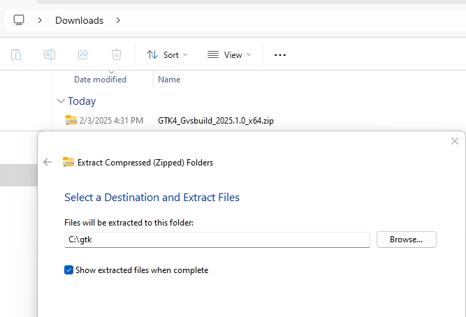
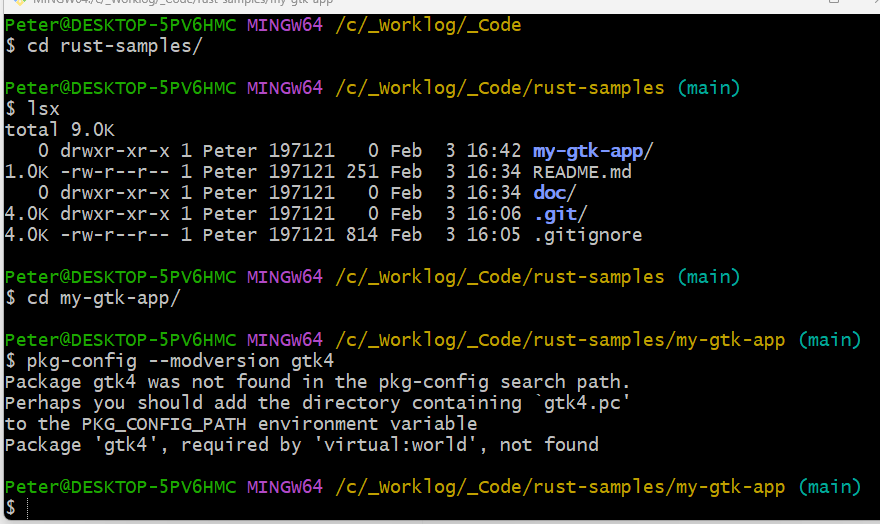
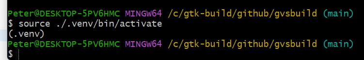
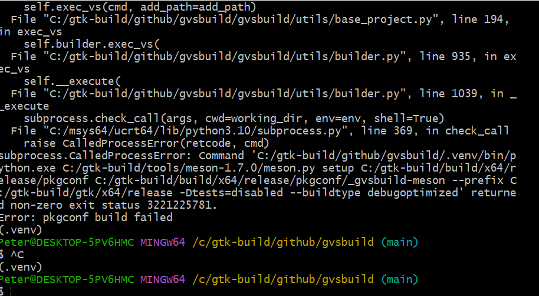
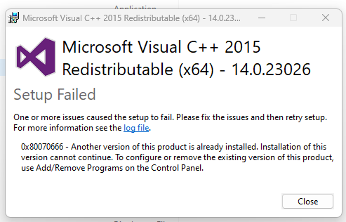

# rust-samples

## General

### `rustup` Location On Windows

- `C:\Users\Peter\.rustup`

### Project Setup On Windows

- Downloaded `gtk` from [here](https://github.com/wingtk/gvsbuild#development-environment)
- Followed instructions

1

- Added (or updated as needed) those environment variables and then got this:



- Perhaps I need to reboot to get these to take effect...
- Trying to follow instructions on building and they are not correct:
- (Specifically the location of the `activate` script to use and how to call it)



- Now getting this build error:



- Found [this](https://stackoverflow.com/questions/58464223/how-to-fix-that-running-any-defined-script-in-npm-fails-with-error-3221225781)
- Which looks promising.
- Trying download and install of Visual C++



- Finally go this to work.
- I installed the `Microsoft.VisualStudio.2022.BuildTools` build BuildTools
- I updated the python version, installed pip and pipx and ensurepath per the instructions:

```text
py -3.13 -m pip install --user pipx
py -3.13 -m pipx ensurepath
pipx install gvsbuild
```

- Just used the command `gvsbuild build gtk4`
- Not sure of which exact step or all were required. Suspect it was the `VS` install and the `pipx` and `ensurepath`
- I remember seeing some posts/comments about Windows path lengths limited to 260 characters with the error number I was getting originally